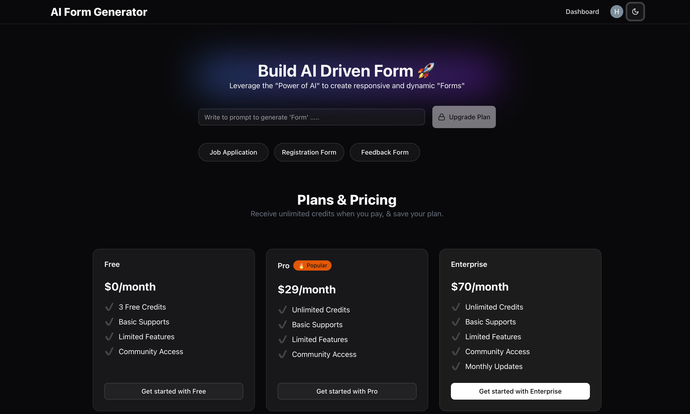

# AI-Form-Generator



*Leveraging AI to create forms like job applications, feedback forms, and more.*

## Overview
AI Form Generator is a powerful web application that allows users to create dynamic forms using OpenAI, manage subscriptions with Stripe, and analyze form submissions efficiently. Built with modern technologies like Supabase, Prisma, Docker, TypeScript, Next.js, Clerk, and OpenAI, this project provides a seamless and scalable solution for form generation.

## Features

- **User Authentication**: Secure login functionality powered by Clerk.
- **AI-Powered Form Creation**: Generate dynamic forms using OpenAI.
- **Subscription Management**: Stripe integration with webhooks to handle payments and subscriptions.
- **Custom Prompts**: Users can provide their own input prompts to create unique forms.
- **Form Analysis**: Display insights based on submitted form responses.
- **Publish & Edit Forms**: Users can create, publish, and modify their forms easily.

## Tech Stack

- **Frontend**: Next.js, TypeScript
- **Backend**: Supabase, Prisma, OpenAI API
- **Authentication**: Clerk
- **Payments**: Stripe
- **Deployment**: Docker

## Installation

### Prerequisites
Ensure you have the following installed:
- Node.js (latest LTS version recommended)
- Docker
- Supabase account
- Stripe account
- Clerk account
- Prisma account

### Steps

1. Clone the repository:
   ```sh
   git clone https://github.com/yourusername/ai-form-generator.git
   cd ai-form-generator
   ```
2. Install dependencies:
   ```sh
   npm install
   ```
3. Set up environment variables:
   Create a `.env` file and add the necessary credentials:
   ```env
   DATABASE_URL=your_prisma_database_url
   DIRECT_URL=your_prisma_database_url
   NEXT_PUBLIC_CLERK_PUBLISHABLE_KEY=your_clerk_publishable_key
   CLERK_SECRET_KEY=your_clerk_secret_key
   NEXT_PUBLIC_CLERK_SIGN_IN_URL=your_clerk_sign_url
   NEXT_PUBLIC_CLERK_SIGN_IN_FALLBACK_REDIRECT_URL=/
   NEXT_PUBLIC_PUBLISHABLE_KEY=your_stripe_publishable_key
   STRIPE_SECRET_KEY=your_stripe_secret_key
   OPENAI_API_KEY=your_openai_api_key
   NEXT_PUBLIC_BASE_URL=your_base_url
   WEBHOOK_ENDPOINT_SECRET=your_webhook_endpoint_secret
   ```
4. Run the database migrations:
   ```sh
   npx prisma migrate dev --name required_model_created
   ```
5. Generate Prisma Client:
   ```sh
   npx prisma generate
   ```
6. Start the development server:
   ```sh
   npm run dev
   ```

## Packages & Libraries

Install the necessary packages using the following commands:

```sh
npx create-next-app@latest
npx prisma init
npx prisma migrate dev --name required_model_created
npx prisma generate
npm install @clerk/nextjs
npx shadcn@latest init
npx shadcn@latest add input label button card
npm install next-themes
npx shadcn@latest add progress
npm i zod openai
npx prisma migrate dev --name subscription_model_created
npx shadcn@latest add sidebar dialog
npm i @stripe/stripe-js
npm i stripe -g
```

## Webhook Integration

Set up Stripe webhook integration with the following steps:

```sh
stripe login
stripe listen --forward-to localhost:3000/api/webhook
stripe trigger payment_intent.succeeded
```

## Docker Integration

1. Create a `Dockerfile`.
2. Add a `.dockerignore` file (works similar to `.gitignore`).
3. Build the Docker image:
   ```sh
   docker build -t ai-form-generator .
   ```
4. List Docker images:
   ```sh
   docker images
   ```
5. Run the container:
   ```sh
   docker run -it -p 3000:3000 ai-form-generator
   ```
6. Check running containers:
   ```sh
   docker ps -a
   ```
7. Push the image to Docker Hub:
   ```sh
   docker push your-dockerhub-image-name
   ```

## Contributing
Pull requests are welcome! Feel free to open an issue for feature suggestions or bug reports.

## Contact
For any queries, reach out via [email](heytgala26@gmail.com) or [GitHub](https://github.com/Heytgala).
